[**Try the live demo →**](https://smashvision-superiorswarm-nyax3.ondigitalocean.app)

# One KBC. Your version.

**Our entry for the KBC challenge at the Tectonic Hackathon:** a banking home screen that rebuilds itself around each customer, based on what is happening in their life and how they actually use the app.

Built by **Emma van Doren** ([SmashVision](https://smashvision.ai)) and **Thomas Vrolix** ([SuperiorSwarm](https://superiorswarm.com)).

> One KBC app · 2.3M different dashboards · customised for you only

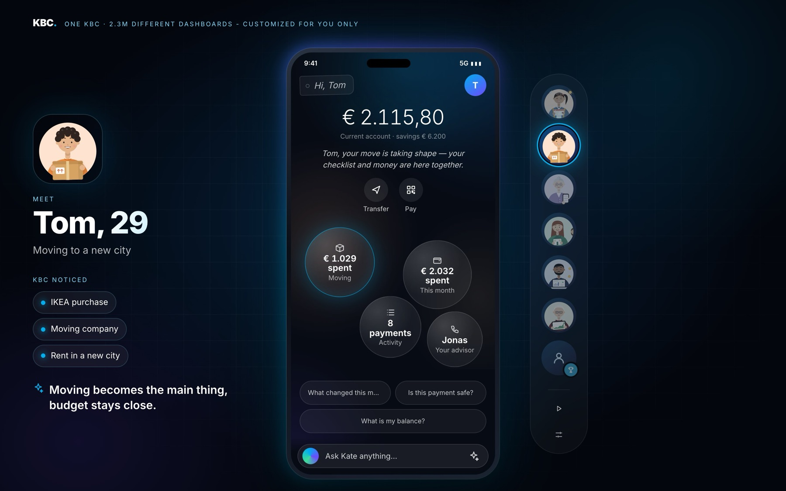

<sub>The demo stage: pick a character on the right, see what KBC noticed on the left, and watch the phone rebuild in the middle.</sub>

---

## In 30 seconds

- **Same app, a different home for everyone.** Balance, Transfer and Pay never move. Everything below them is chosen, sized and ordered for this customer, right now.
- **Behaviour beats age.** A 74-year-old who zooms in gets big, calm buttons. A 71-year-old who checks his portfolio daily gets the detailed investor view. Age alone never decides.
- **Explainable and in control.** Every personal item says *why* it's there, and can be pinned or hidden. When the evidence is weak, the app *asks* instead of assuming.
- **Kate, a grounded assistant.** Kate answers questions about your own money in plain language, with optional Claude responses grounded in the demo data. Checks reject unsupported amounts and unsafe output; instructions direct her to refer big decisions to your human advisor.

---

## What we built

| | Piece | What it does |
| --- | --- | --- |
| 📱 | **Adaptive home** | A calm, bubble-based home screen. Each bubble is one thing that matters to you now, sized by how much it matters, with a live figure. |
| ⚙️ | **Personalisation engine** | Turns transactions and app behaviour into *needs* with a confidence score, then ranks what to show and picks the layout density. Fully explainable. |
| 💬 | **Kate** | An assistant that explains your overview, powered by Claude, with safety rules in both the prompt and the code, and an offline fallback. |
| 🧱 | **Building blocks** | A catalogue of 28 widgets in 3 sizes and 3 content depths, plus large text: the vocabulary an AI layer can use to compose each customer's home. |

---

## Same app, seven people

Every character below uses the same app. Only the data and behaviour differ. All of it is synthetic: no real customers, no real payments.

<table>
  <tr>
    <td align="center" width="25%">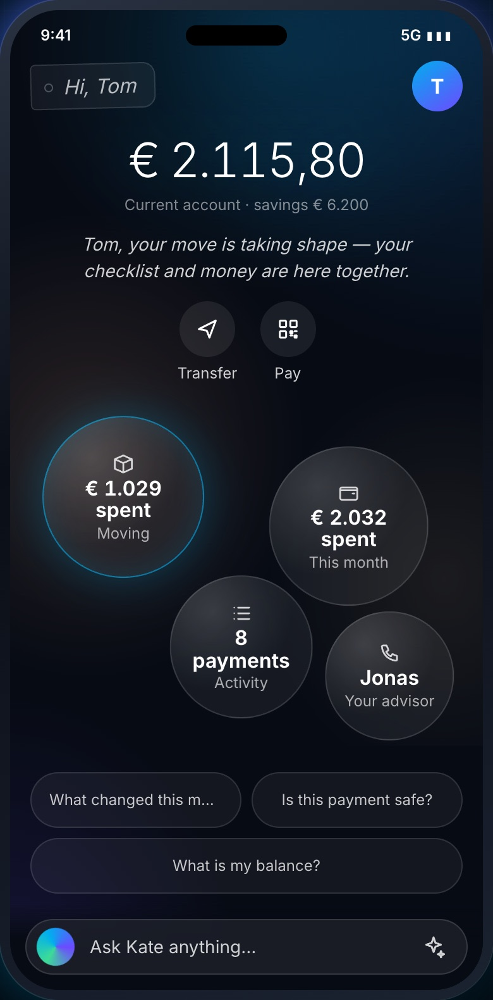<br><b>Tom, 29</b><br><sub>IKEA, movers, rent in a new city → <b>the move leads</b>, budget stays close</sub></td>
    <td align="center" width="25%">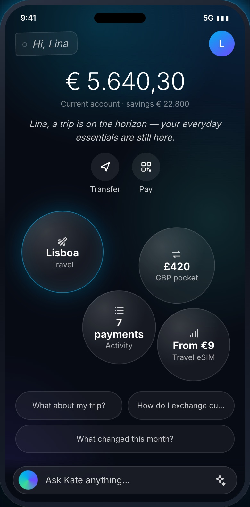<br><b>Lina, 31</b><br><sub>Flight to Lisbon, card used abroad → <b>trip, currency and eSIM</b></sub></td>
    <td align="center" width="25%">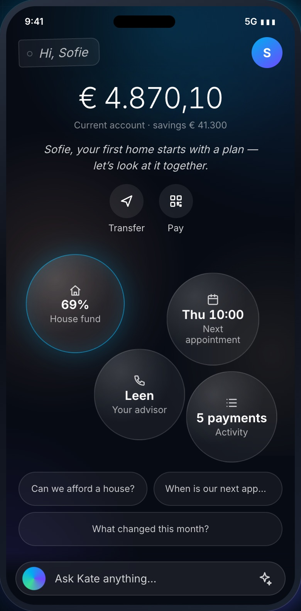<br><b>Sofie & Pieter</b><br><sub>Saving for a home, mortgage simulator → <b>house fund 69%</b></sub></td>
    <td align="center" width="25%">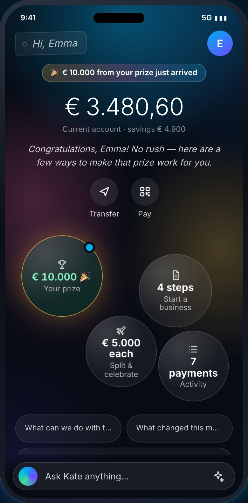<br><b>Emma & Thomas</b><br><sub>€10,000 prize lands → <b>celebrate, then ideas</b>, never pressure</sub></td>
  </tr>
  <tr>
    <td align="center">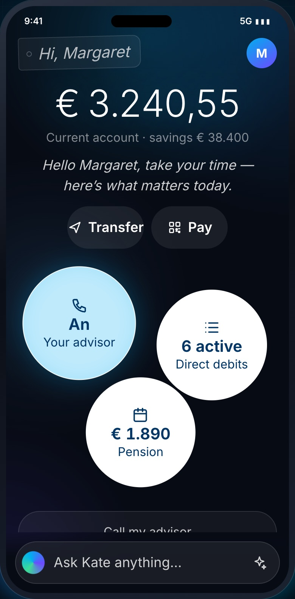<br><b>Margaret, 74</b><br><sub>Large text, zooms, mis-taps → <b>simple view</b>: 3 big bubbles</sub></td>
    <td align="center">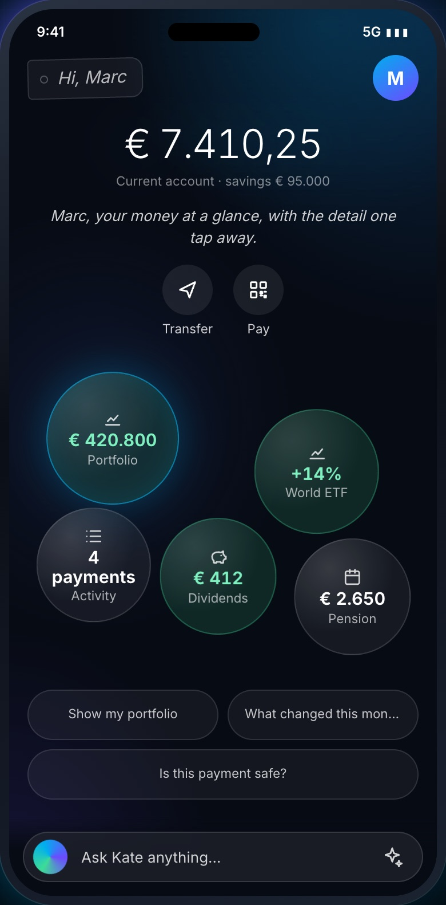<br><b>Marc, 71</b><br><sub>Checks his portfolio 12× a week → <b>detailed view</b>: 5 bubbles</sub></td>
    <td align="center">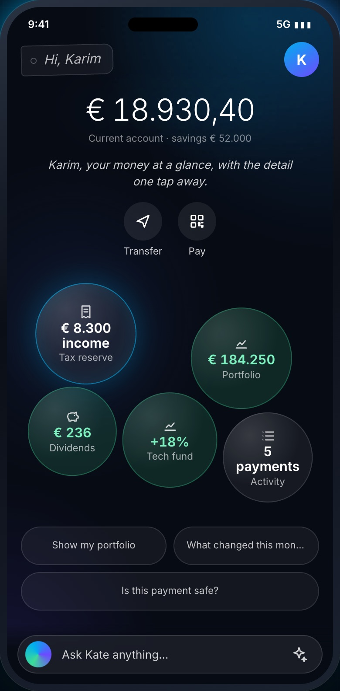<br><b>Karim, 45</b><br><sub>Freelancer, irregular income → <b>tax reserve first</b>, then investments</sub></td>
    <td valign="middle"><b>Look at Margaret and Marc.</b><br><br>They are 74 and 71. A demographic rule would give them the same "senior" app. Our engine looks at <i>behaviour</i> instead: Margaret enlarges text and mis-taps, so she gets fewer, bigger, calmer items. Marc is a hands-on investor, so he gets the most detailed home of all.</td>
  </tr>
</table>

---

## How the engine works

The engine is a transparent pipeline, not a black box. Every step can be inspected live in the demo (*Inside the engine*).

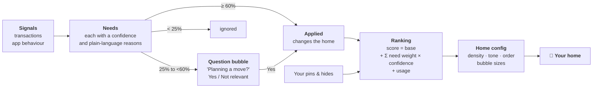

- **Signals** are things a bank already knows: a payment to a moving company, rent to a landlord in another city, a flight booking. Behaviour counts too: large text, pinch-zooming, mis-taps, how often you open your portfolio.
- **Needs** carry evidence. For Tom: *"Payment to Verhuisfirma Snel (Gent)"* and *"Rent paid to a landlord in Gent, not Leuven"* add up to a 98% moving need.
- **Low confidence becomes a question, never a claim.** One IKEA purchase could be a move, or just a new shelf, so the app asks.
- **Density** (simple, standard, detailed) comes only from behaviour and controls text size, touch targets and how many bubbles you see (3, 4 or 5).
- **The core never moves.** Balance, Transfer and Pay stay in the same place for everyone.

<p align="center">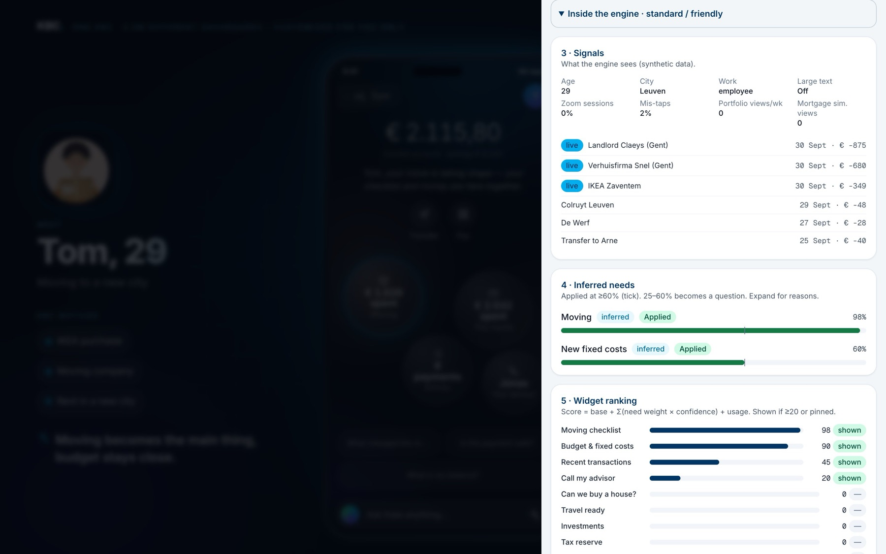</p>
<p align="center"><sub>Inside the engine for Tom: the signals it sees, the needs it inferred (Moving 98%, New fixed costs 60%) and the resulting widget ranking.</sub></p>

---

## Explainable, and you stay in control

<table>
  <tr>
    <td width="36%">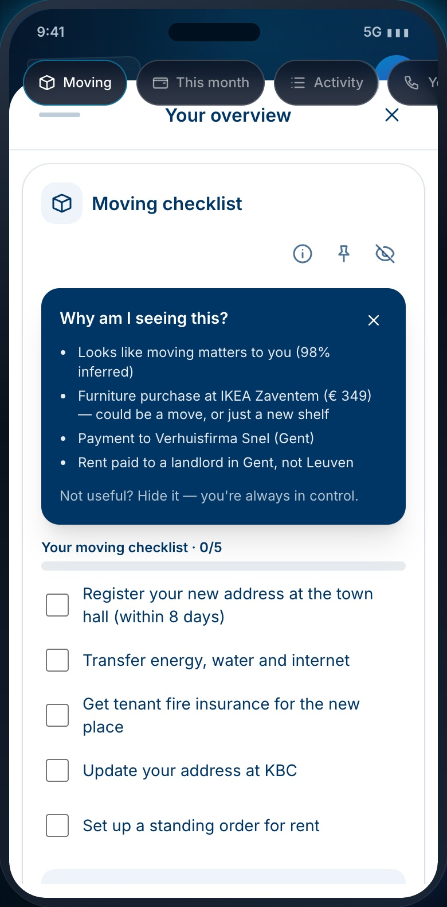</td>
    <td>
      <p>Tap any bubble and it opens into a full widget. Every personal widget has three controls:</p>
      <ul>
        <li><b>ⓘ Why am I seeing this?</b> The exact reasons, in plain language: <i>"Furniture purchase at IKEA Zaventem (€ 349): could be a move, or just a new shelf."</i></li>
        <li><b>📌 Pin</b> keeps something on your home, whatever the engine thinks.</li>
        <li><b>🙈 Hide</b> removes it. <i>"Not useful? Hide it. You're always in control."</i></li>
      </ul>
      <p>Pins and hides feed straight back into the ranking. The customer, not the algorithm, has the last word.</p>
    </td>
  </tr>
</table>

---

## Kate: an assistant that knows your money, and her limits

<table>
  <tr>
    <td>
      <p>Kate explains your own overview in plain language. Ask <i>"What changed this month?"</i>, <i>"Is this payment safe?"</i> or <i>"Can we afford a house?"</i>.</p>
      <p>On the right, Sofie asks about a house. Kate:</p>
      <ul>
        <li>uses <b>their synthetic demo figures</b>: €41,300 saved of €60,000, €5,300 joint income</li>
        <li><b>won't decide affordability</b>, and says so</li>
        <li>points to their <b>human advisor</b>, and even their upcoming appointment</li>
        <li>offers a button to open the <b>house planner</b></li>
      </ul>
      <p>Kate can use <b>Claude</b> (Anthropic) through the optional server API. Without an API key or a reachable API, she uses built-in answers for common questions. The static deployment uses these built-in answers.</p>
    </td>
    <td width="36%">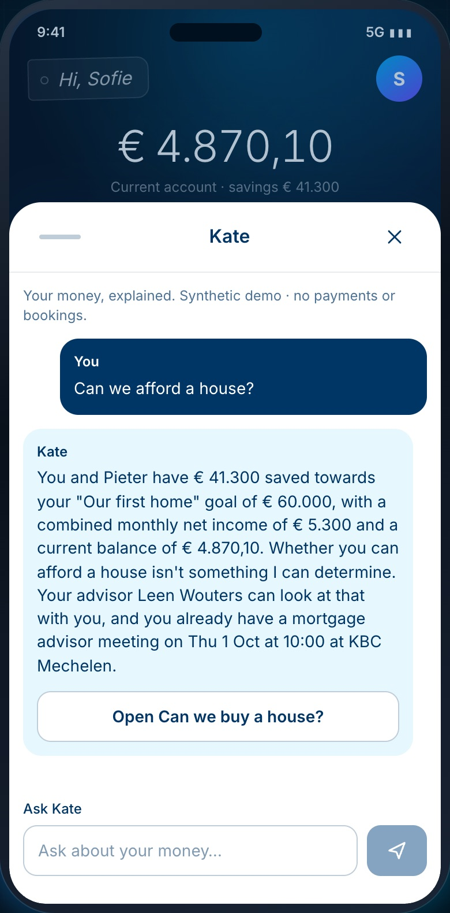</td>
  </tr>
</table>

### Safe by design

Kate combines instructions about scope and advice with code that checks reply structure, amounts, links, credential requests and prompt leaks. These are prototype safeguards; they do not guarantee that every answer is correct or appropriate.

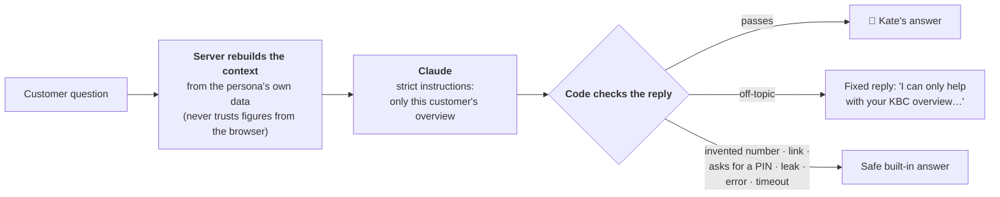

| Intended behaviour | Restrictions in the prompt and output checks |
| --- | --- |
| Explain balances, spending, savings goals and payments | Invent a number that isn't in your data |
| Compare this month with last month | Give investment advice or say what to buy or sell |
| Share the figures behind a big decision | Decide whether you can afford a mortgage |
| Refer you to your named advisor | Claim a payment is safe, or that she made or stopped one |
| Warn you never to share your PIN | Ask for a PIN, password or card number, or send links |
| Answer follow-up questions | Answer off-topic questions, or follow "ignore your instructions" |

Automated tests cover forged chat history, prompt-leak detection, links, credential requests, unsupported amounts, provider failures and timeouts. Spending and rate limits apply per server process; they reset on restart and are not an account-wide spending limit.

---

## Building blocks for an AI-composed home

<p align="center">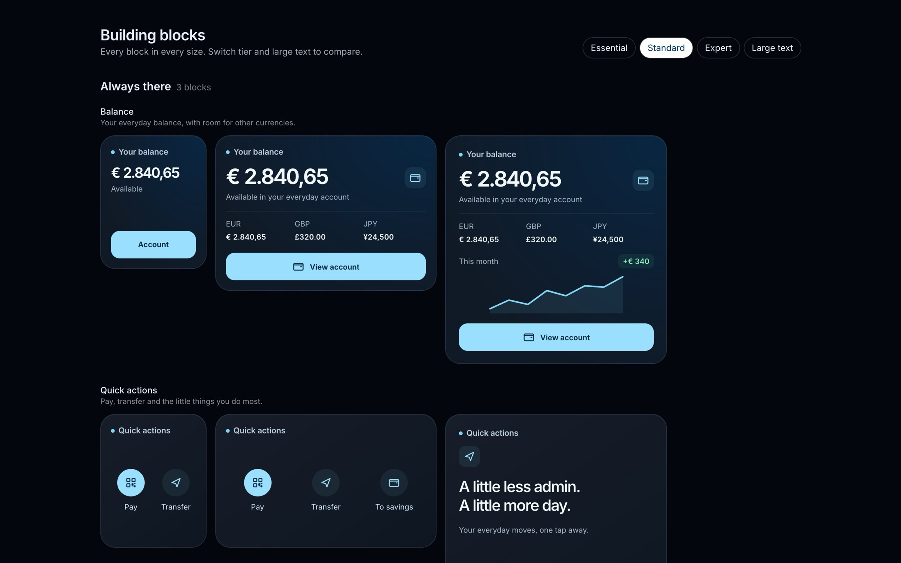</p>

The next step is to let an AI layer compose each customer's home. To make that safe, we built a fixed **catalogue of 28 blocks** it can choose from:

- **6 groups:** core banking, everyday banking, life moments (house, moving), travel, wealth, and prize & Kate.
- **3 sizes** (1×1, 2×1, 2×2, like iOS widgets) and **3 content depths** (*essential*, *standard*, *expert*), plus **large text** at every depth.
- Depth describes *content*, never the customer's age or ability.
- Planned integration: an AI would pick blocks by id, size and depth, with validation and a rules-engine fallback. This selector is not implemented; the current phone home uses the rules engine and its own widget components.

The full catalogue is in [docs/building-blocks.md](docs/building-blocks.md), and the gallery runs at `/blocks`.

---

## Principles we designed by

1. **Calm, not clever.** No urgency, no FOMO, no gamification. A €10,000 prize gets a celebration and ideas, not a sales pitch.
2. **Behaviour, never demographics.** Accessibility comes from how you use the app, not your birth year.
3. **Suggest, then ask.** Weak evidence becomes a question the customer can dismiss.
4. **Always explainable.** Every personal item can answer *"Why am I seeing this?"*.
5. **The customer has the last word.** Pin, hide and "Not relevant" all feed back into the engine.
6. **A human for big decisions.** Mortgages and investments always lead to a named advisor.
7. **Stable core.** Balance, Transfer and Pay never move, whoever you are.

---

## What's real and what's mocked

| Real, working in the prototype | Mocked for the demo |
| --- | --- |
| Personalisation engine: signals → needs → ranking → layout | Customer data: 7 synthetic personas |
| Explanations, pins, hides and question bubbles | Transactions: injected as demo "live signals" |
| Kate powered by Claude, with safety checks in code and a spending cap | Actions such as calls, payments, exchanges and bookings are previews only |
| Built-in Kate responses: no API key needed once the app is loaded | eSIM and currency exchange are *proposed services* |
| Accessibility: density, large text, reduced motion, keyboard and screen-reader support | Building blocks are not yet wired into the phone home |
| Automated tests for the engine, presentation, Kate, payment input and mortgage calculation (`bun test`) | |

---

## Try it

Use Node.js 24 (`nvm use`) and Bun 1.3.9. No database, Supabase account or environment variables are required for the demo. Pins and hides persist in browser `localStorage`; chat and injected events stay in memory.

```sh
bun install --frozen-lockfile
bun dev
```

Open http://localhost:3000.

1. Press **▶ Play tour** (right-hand rail) to watch all seven characters in turn, or click a character.
2. Tap a **bubble**, then **ⓘ** to see why it's there. Try **pin** and **hide**.
3. Tap **Ask Kate anything…**, or one of the suggestion pills.
4. Open **Inside the engine** (the sliders icon) and inject a live signal, for example *IKEA purchase* for Tom, or *€2,400 to a new payee*, and watch the home rebuild.

For optional Claude responses in local development, copy `.env.example` to `.env.local`, set `ANTHROPIC_API_KEY`, and restart `bun dev`. Keep the key server-side.

`bun run build` exports the site to `out/`, and `bun start` serves that static output. Static hosting has no Kate API and uses built-in responses even if a key was present during the build. Claude in production requires a Next.js server deployment; see the [developer guide](docs/DEVELOPMENT.md#deployment). The app is not an offline-installable PWA.

---

**Built with** Next.js, React, TypeScript, Tailwind CSS, Motion and Claude (Anthropic).

**For developers:** architecture, setup, Kate's guardrails in detail and deployment are in [docs/DEVELOPMENT.md](docs/DEVELOPMENT.md). The characters are described in [docs/personas.md](docs/personas.md).
