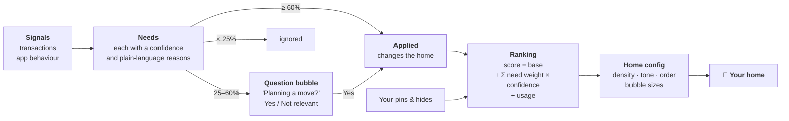
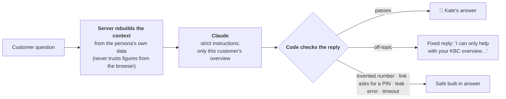
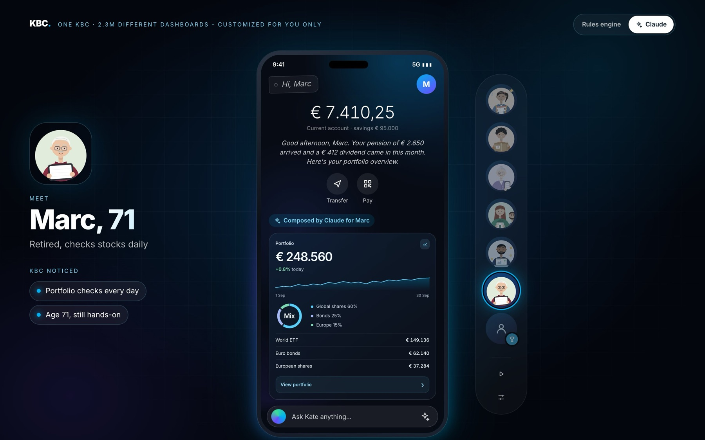
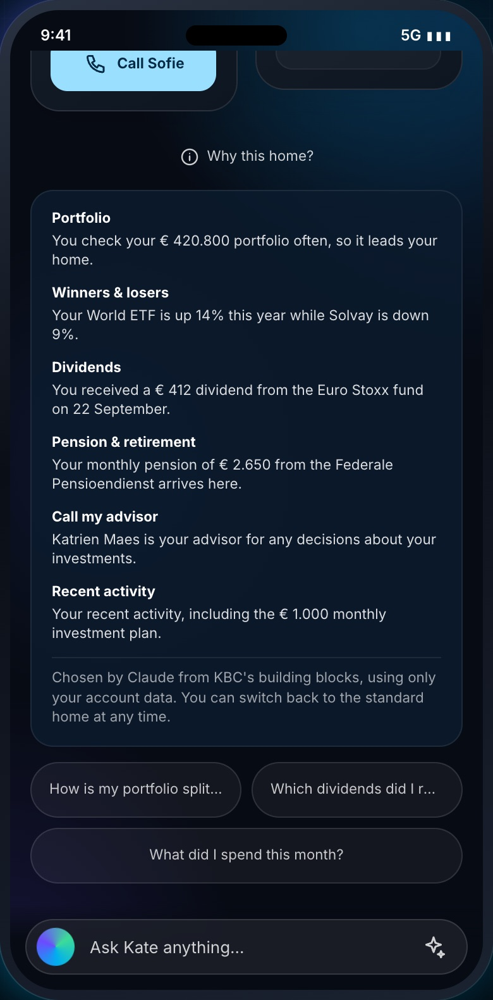

# One KBC. Your version.

**Our entry for the KBC challenge at the Tectonic Hackathon:** a banking home screen that rebuilds itself around each customer, based on what is happening in their life and how they actually use the app.

> One KBC app · 2.3M different dashboards · customised for you only


<sub>The demo stage: pick a character on the right, see what KBC noticed on the left, and watch the phone rebuild in the middle.</sub>

---

## In 30 seconds

- **Same app, a different home for everyone.** Balance, Transfer and Pay never move. Everything below them is chosen, sized and ordered for this customer, right now.
- **Behaviour beats age.** A 74-year-old who zooms in gets big, calm buttons. A 71-year-old who checks his portfolio daily gets the detailed investor view. Age alone never decides.
- **Explainable and in control.** Every personal item says *why* it's there, and can be pinned or hidden. When the evidence is weak, the app *asks* instead of assuming.
- **Kate, a grounded assistant.** Kate answers questions about your own money in plain language, powered by Claude. She never invents figures, never gives investment advice, and refers big decisions to your human advisor.

---

## What we built

| | Piece | What it does |
| --- | --- | --- |
| 📱 | **Adaptive home** | A calm, bubble-based home screen. Each bubble is one thing that matters to you now, sized by how much it matters, with a live figure. |
| ⚙️ | **Personalisation engine** | Turns transactions and app behaviour into *needs* with a confidence score, then ranks what to show and picks the layout density. Fully explainable. |
| 💬 | **Kate** | An assistant that explains your overview, powered by Claude, with safety rules in both the prompt and the code, and an offline fallback. |
| 🧱 | **Building blocks** | A catalogue of 27 widgets in 3 sizes and 3 content depths, plus large text: the vocabulary an AI layer can use to compose each customer's home. |
| ✦ | **Claude composes the home** | An opt-in switch: Claude picks and orders the building blocks for each customer and writes their personal message. The rules engine stays the default. |

---

## Same app, seven people

Every character below uses the same app. Only the data and behaviour differ. All of it is synthetic: no real customers, no real payments.

<table>
  <tr>
    <td align="center" width="25%"><br><b>Tom, 29</b><br><sub>IKEA, movers, rent in a new city → <b>the move leads</b>, budget stays close</sub></td>
    <td align="center" width="25%"><br><b>Lina, 31</b><br><sub>Flight to Lisbon, card used abroad → <b>trip, currency and eSIM</b></sub></td>
    <td align="center" width="25%"><br><b>Sofie & Pieter</b><br><sub>Saving for a home, mortgage simulator → <b>house fund 69%</b></sub></td>
    <td align="center" width="25%"><br><b>Emma & Thomas</b><br><sub>€10,000 prize lands → <b>celebrate, then ideas</b>, never pressure</sub></td>
  </tr>
  <tr>
    <td align="center"><br><b>Margaret, 74</b><br><sub>Large text, zooms, mis-taps → <b>simple view</b>: 3 big bubbles</sub></td>
    <td align="center"><br><b>Marc, 71</b><br><sub>Checks his portfolio 12× a week → <b>detailed view</b>: 5 bubbles</sub></td>
    <td align="center"><br><b>Karim, 45</b><br><sub>Freelancer, irregular income → <b>tax reserve first</b>, then investments</sub></td>
    <td valign="middle"><b>Look at Margaret and Marc.</b><br><br>They are 74 and 71. A demographic rule would give them the same "senior" app. Our engine looks at <i>behaviour</i> instead: Margaret enlarges text and mis-taps, so she gets fewer, bigger, calmer items. Marc is a hands-on investor, so he gets the most detailed home of all.</td>
  </tr>
</table>

---

## How the engine works

The engine is a transparent pipeline, not a black box. Every step can be inspected live in the demo (*Inside the engine*).



- **Signals** are things a bank already knows: a payment to a moving company, rent to a landlord in another city, a flight booking. Behaviour counts too: large text, pinch-zooming, mis-taps, how often you open your portfolio.
- **Needs** carry evidence. For Tom: *"Payment to Verhuisfirma Snel (Gent)"* and *"Rent paid to a landlord in Gent, not Leuven"* add up to a 98% moving need.
- **Low confidence becomes a question, never a claim.** One IKEA purchase could be a move, or just a new shelf, so the app asks.
- **Density** (simple, standard, detailed) comes only from behaviour and controls text size, touch targets and how many bubbles you see (3, 4 or 5).
- **The core never moves.** Balance, Transfer and Pay stay in the same place for everyone.

<p align="center"></p>
<p align="center"><sub>Inside the engine for Tom: the signals it sees, the needs it inferred (Moving 98%, New fixed costs 60%) and the resulting widget ranking.</sub></p>

---

## Explainable, and you stay in control

<table>
  <tr>
    <td width="36%"></td>
    <td>
      <p>Tap any bubble and it opens into a full widget. Every personal widget has three controls:</p>
      <ul>
        <li><b>ⓘ Why am I seeing this?</b> The exact reasons, in plain language: <i>"Furniture purchase at IKEA Zaventem (€ 349): could be a move, or just a new shelf."</i></li>
        <li><b>📌 Pin</b> keeps something on your home, whatever the engine thinks.</li>
        <li><b>🙈 Hide</b> removes it. <i>"Not useful? Hide it. You're always in control."</i></li>
      </ul>
      <p>Pins and hides feed straight back into the ranking. The customer, not the algorithm, has the last word.</p>
    </td>
  </tr>
</table>

---

## Kate: an assistant that knows your money, and her limits

<table>
  <tr>
    <td>
      <p>Kate explains your own overview in plain language. Ask <i>"What changed this month?"</i>, <i>"Is this payment safe?"</i> or <i>"Can we afford a house?"</i>.</p>
      <p>On the right, Sofie asks about a house. Kate:</p>
      <ul>
        <li>uses <b>only their real figures</b>: €41,300 saved of €60,000, €5,300 joint income</li>
        <li><b>won't decide affordability</b>, and says so</li>
        <li>points to their <b>human advisor</b>, and even their upcoming appointment</li>
        <li>offers a button to open the <b>house planner</b></li>
      </ul>
      <p>Kate is powered by <b>Claude</b> (Anthropic). Without an API key or internet, she falls back to built-in answers, so the demo always works.</p>
    </td>
    <td width="36%"></td>
  </tr>
</table>

### Safe by design

A banking assistant has to be trustworthy, so Kate's rules are enforced twice: once in her instructions, and again in code that checks every reply before the customer sees it.



| Kate will | Kate won't |
| --- | --- |
| Explain balances, spending, savings goals and payments | Invent a number that isn't in your data |
| Compare this month with last month | Give investment advice or say what to buy or sell |
| Share the figures behind a big decision | Decide whether you can afford a mortgage |
| Refer you to your named advisor | Claim a payment is safe, or that she made or stopped one |
| Warn you never to share your PIN | Ask for a PIN, password or card number, or send links |
| Answer follow-up questions | Answer off-topic questions, or follow "ignore your instructions" |

We tested Kate live against prompt-injection attempts, including fake "SYSTEM OVERRIDE" messages, requests to reveal her instructions, phishing links, hidden base64 commands and a forged chat history. All were blocked. A spending cap and rate limits protect the API budget.

---

## Building blocks, composed by Claude

The rules engine is predictable and explainable, and it's the default. With the **Rules engine | ✦ Claude** switch at the top of the demo, Claude designs each customer's home instead.



<table>
  <tr>
    <td>
      <p>Claude receives the customer's own data (needs, transactions, savings goals, how they use the app) and our <b>catalogue of 27 building blocks</b>. It decides:</p>
      <ul>
        <li><b>which blocks</b> appear, and in what order</li>
        <li>each block's <b>size</b> (1×1, 2×1 or 2×2, like iOS widgets) and <b>content depth</b> (<i>essential</i>, <i>standard</i> or <i>expert</i>)</li>
        <li>the <b>personal message</b> under the balance</li>
        <li>three <b>questions to ask Kate</b></li>
        <li>a <b>reason for every block</b>, shown under <i>Why this home?</i></li>
      </ul>
      <p>The same safety rules as Kate apply. Every text is checked in code for invented amounts, links and credential requests. If anything fails, or Claude is unavailable, the customer gets the standard home. Depth still comes from behaviour, never age: Margaret's layout uses large text and at most three blocks.</p>
    </td>
    <td width="36%"></td>
  </tr>
</table>

<p align="center"></p>

The full catalogue is in [docs/building-blocks.md](docs/building-blocks.md), and the gallery runs at `/blocks`. Blocks currently show their own demo figures; wiring each block to the customer's live data is the next step.

---

## Principles we designed by

1. **Calm, not clever.** No urgency, no FOMO, no gamification. A €10,000 prize gets a celebration and ideas, not a sales pitch.
2. **Behaviour, never demographics.** Accessibility comes from how you use the app, not your birth year.
3. **Suggest, then ask.** Weak evidence becomes a question the customer can dismiss.
4. **Always explainable.** Every personal item can answer *"Why am I seeing this?"*.
5. **The customer has the last word.** Pin, hide and "Not relevant" all feed back into the engine.
6. **A human for big decisions.** Mortgages and investments always lead to a named advisor.
7. **Stable core.** Balance, Transfer and Pay never move, whoever you are.

---

## What's real and what's mocked

| Real, working in the prototype | Mocked for the demo |
| --- | --- |
| Personalisation engine: signals → needs → ranking → layout | Customer data: 7 synthetic personas |
| Explanations, pins, hides and question bubbles | Transactions: injected as demo "live signals" |
| Kate powered by Claude, with safety checks in code and a spending cap | Actions such as calls, payments, exchanges and bookings are previews only |
| Offline fallback: the demo runs without internet or a key | eSIM and currency exchange are *proposed services* |
| Claude composing the home from the building blocks, with checks and a fallback | Building blocks show their own demo figures, not yet the customer's |
| Accessibility: density, large text, reduced motion, keyboard and screen-reader support | |
| 58 automated tests | |

---

## Try it

```sh
bun install
bun dev
```

Open http://localhost:3000.

1. Press **▶ Play tour** (right-hand rail) to watch all seven characters in turn, or click a character.
2. Tap a **bubble**, then **ⓘ** to see why it's there. Try **pin** and **hide**.
3. Tap **Ask Kate anything…**, or one of the suggestion pills.
4. Open **Inside the engine** (the sliders icon) and inject a live signal, for example *IKEA purchase* for Tom, or *€2,400 to a new payee*, and watch the home rebuild.
5. Flip the switch at the top to **✦ Claude** and pick a character: Claude composes their home from the building blocks. Tap **Why this home?**.

Kate and the Claude-composed home use Claude when `ANTHROPIC_API_KEY` is set in `.env.local`. Without a key, Kate answers from built-in responses and the switch shows the standard home.

---

**Built with** Next.js, React, TypeScript, Tailwind CSS, Motion and Claude (Anthropic).

**For developers:** architecture, setup, Kate's guardrails in detail and deployment are in [docs/DEVELOPMENT.md](docs/DEVELOPMENT.md). The characters are described in [docs/personas.md](docs/personas.md).
